# rootstock

[](https://github.com/sebastianspicker/rootstock/actions)
[](https://www.gnu.org/licenses/gpl-3.0)
[](https://support.apple.com/macos)

Attack path discovery for macOS that maps TCC grants, entitlements, Keychain ACLs, and XPC trust relationships as an exploitable graph.

> **Status:** Phase 7 Complete — Full graph intelligence pipeline with risk scoring, CWE taxonomy, ESF enrichment, vulnerability correlation, and 101 Cypher queries.

## What is Rootstock?

Rootstock is a graph-based attack path discovery tool for macOS security boundaries — think BloodHound for macOS-native trust relationships. It maps:

- **TCC grants** — which apps have camera, microphone, full disk access, etc.
- **Entitlements** — code-signing privileges that weaken security boundaries
- **Code signing** — hardened runtime, library validation, team identifiers, certificate chain analysis
- **Injection vectors** — per-app assessment of DYLD injection viability
- **Vulnerability correlation** — CVE/EPSS/KEV enrichment with ATT&CK technique mapping
- **Risk scoring** — composite 0-100 risk score per application with tier classification
- **Enterprise integration** — Active Directory binding, Kerberos artifacts, BloodHound interop
- **ESF monitoring** — Endpoint Security Framework event coverage gap analysis

## Screenshots

All screenshots below are generated from the [demo scan](examples/demo-scan.json) — synthetic data — 15 apps, 15 TCC grants, 5 XPC services.

### Interactive Graph Viewer

| | |
|---|---|
| 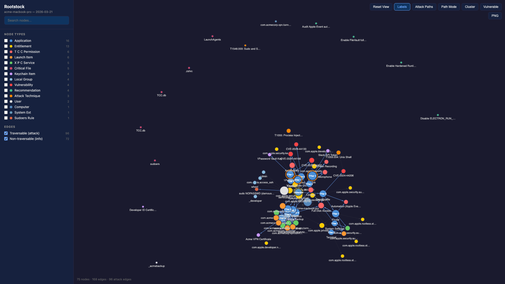 | 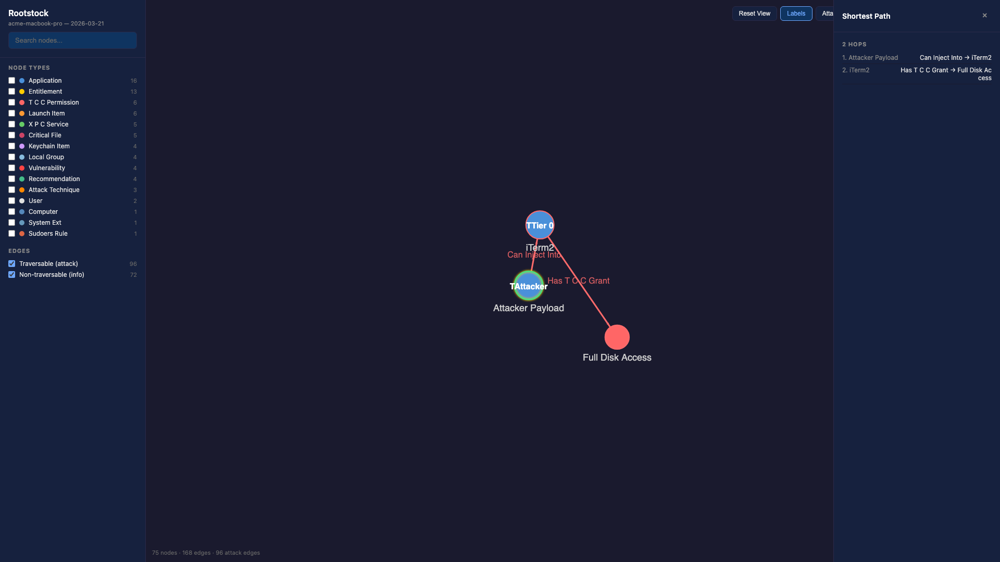 |
| *Full attack graph — 15 node types, color-coded by kind* | *Shortest path from attacker to Full Disk Access (2 hops)* |
| 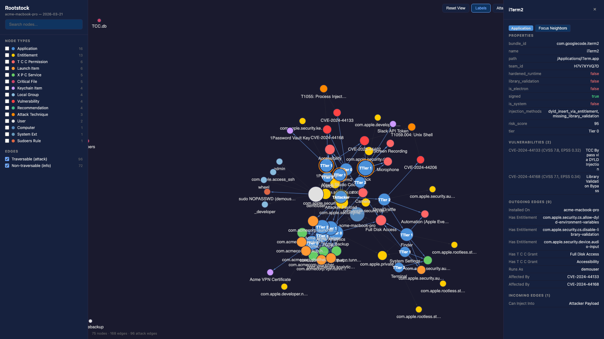 | 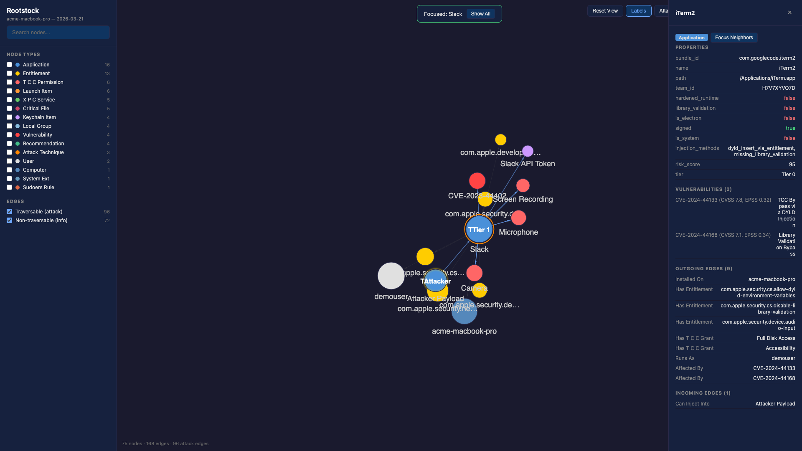 |
| *iTerm2 property inspector with risk score, tier, and entitlements* | *Slack's inherited TCC permissions via focus mode* |

### Security Report

| | |
|---|---|
| 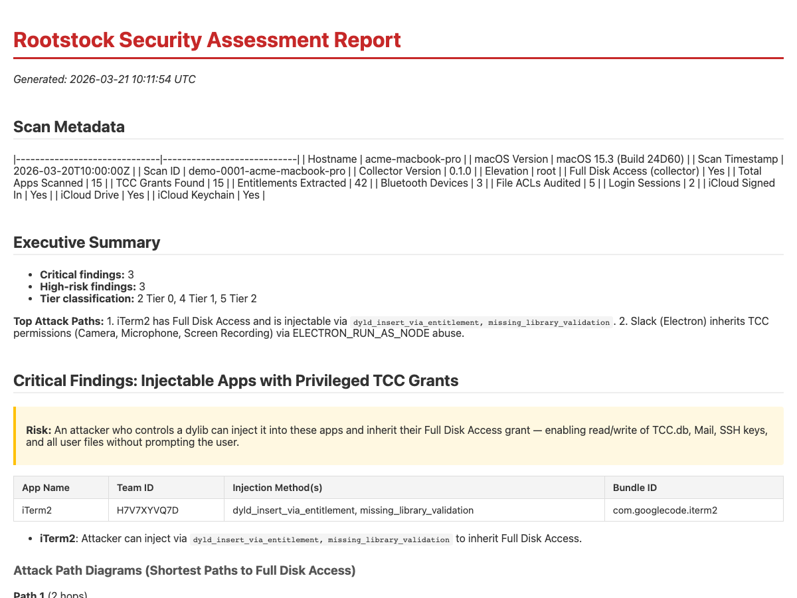 | 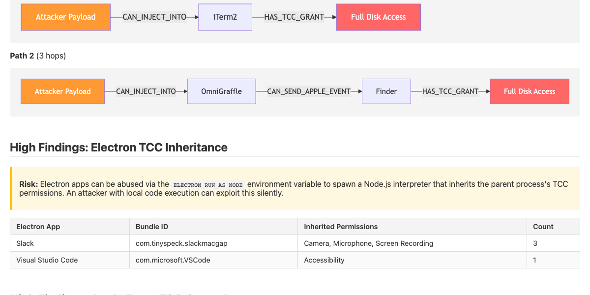 |
| *Executive summary with critical findings and scan metadata* | *Mermaid attack path flowcharts (injectable FDA + Apple Events)* |
| 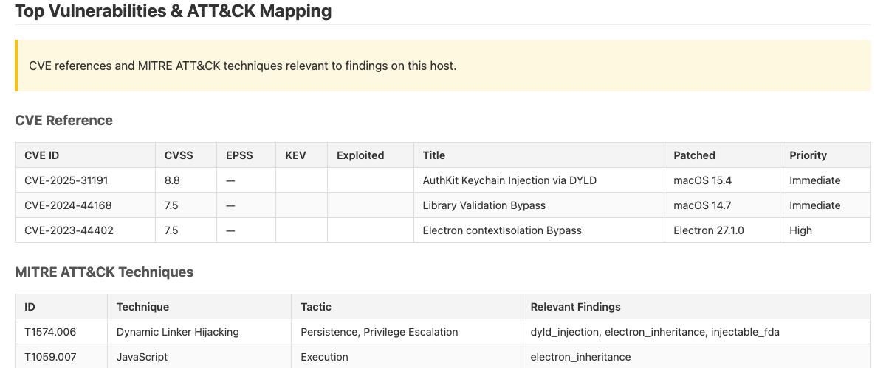 | 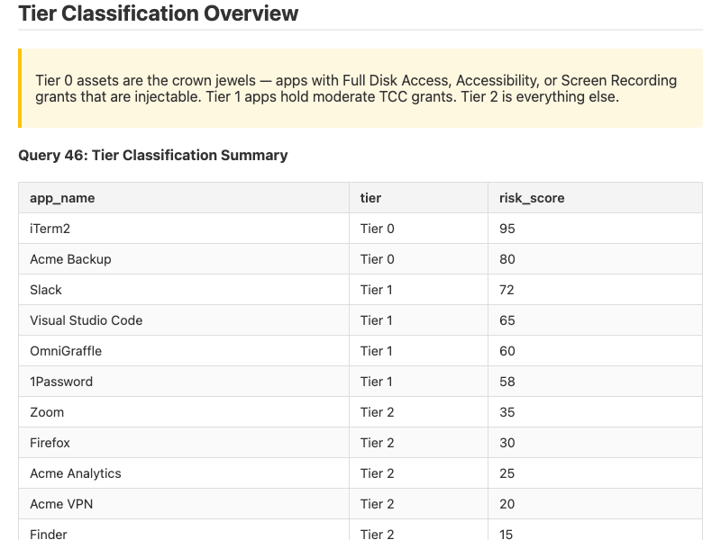 |
| *CVE reference with CVSS/EPSS scores and ATT&CK mapping* | *Tier classification — Tier 0 through Tier 3 with risk scores* |

### Collector CLI

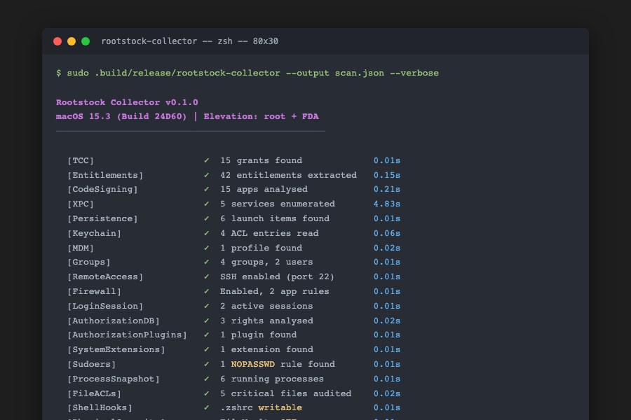

*23 modules, 5.49 seconds*

> Regenerate screenshots: `python3 docs/screenshots/generate_screenshots.py`

### Demo Outputs

| Output | Description |
|--------|-------------|
| [`demo-scan.json`](examples/demo-scan.json) | Synthetic scan data (15 apps, 15 TCC grants, 5 XPC services) |

> To generate report and viewer outputs (requires Neo4j): `bash examples/regenerate.sh`
> This produces `demo-report.md` (attack path report) and `demo-viewer.html` (interactive graph viewer).

<details>
<summary>Mermaid diagrams (GitHub-rendered fallback)</summary>

#### Injectable App to Full Disk Access

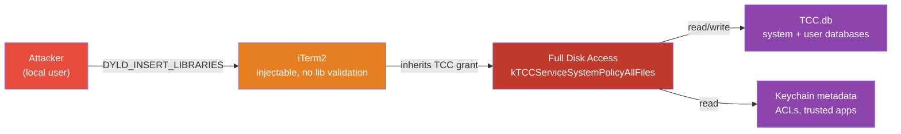

#### Electron TCC Inheritance

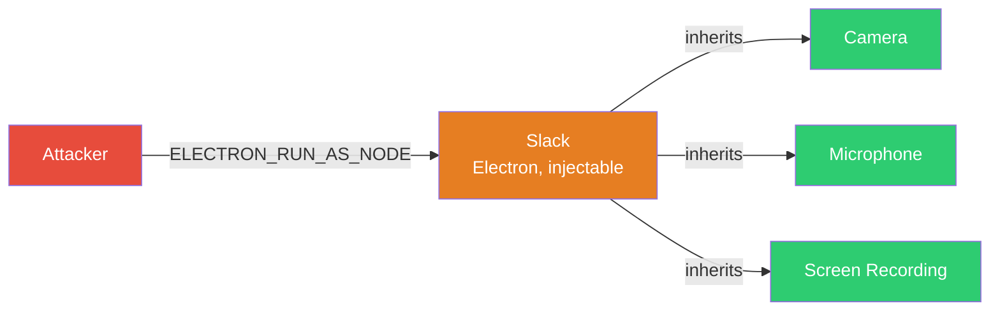

#### Transitive FDA via Finder Automation


#### Asset Tier Classification

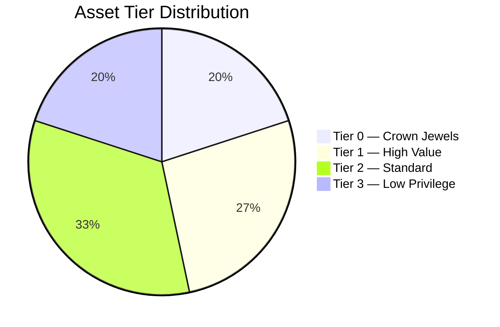

</details>

## Quick Start

### Requirements

**Collector** (runs on the Mac being scanned):
- macOS 14 (Sonoma) or later
- Swift 5.9+ (Xcode 15+)

**Graph pipeline** (runs on analysis workstation):
- Python 3.10+
- Neo4j 5.0+ (Docker recommended: `docker run -p7474:7474 -p7687:7687 neo4j:5`)

### Build

```bash
cd collector
swift build -c release
```

### Run

```bash
# Full scan (TCC + entitlements + code signing)
.build/release/rootstock-collector --output scan.json

# Verbose progress output
.build/release/rootstock-collector --output scan.json --verbose

# TCC grants only
.build/release/rootstock-collector --output scan.json --modules tcc

# Entitlements + code signing only (no TCC)
.build/release/rootstock-collector --output scan.json --modules entitlements,codesigning

# With Full Disk Access (reads system TCC.db)
sudo .build/release/rootstock-collector --output scan.json
```

### Validate Output

```bash
python3 scripts/validate-scan.py scan.json
# ✓ Valid: scan.json (184 apps, 12 TCC grants, 3841 entitlements, 0 collection errors)
```

### Example Output

```json
{
  "scan_id": "7D7DFA2B-...",
  "timestamp": "2026-03-18T08:00:00Z",
  "hostname": "my-mac.local",
  "macos_version": "Version 15.0 (Build 26A...",
  "collector_version": "0.1.0",
  "elevation": {
    "is_root": false,
    "has_fda": false
  },
  "applications": [
    {
      "name": "1Password",
      "bundle_id": "com.1password.1password",
      "path": "/Applications/1Password.app",
      "version": "8.10.56",
      "team_id": "2BUA8C4S2C",
      "hardened_runtime": true,
      "library_validation": true,
      "is_electron": true,
      "is_system": false,
      "signed": true,
      "entitlements": [
        {
          "name": "com.apple.security.cs.allow-jit",
          "is_private": false,
          "category": "injection",
          "is_security_critical": true
        }
      ],
      "injection_methods": ["electron_env_var"]
    }
  ],
  "tcc_grants": [],
  "errors": []
}
```

### Graph Pipeline

```bash
# Install Python dependencies
pip install -e graph/

# Run the full pipeline (schema → import → infer → classify → report)
bash graph/pipeline.sh scan.json

# Or start the API server with interactive viewer
bash graph/pipeline.sh scan.json --serve 8000
# Open http://localhost:8000 for the interactive graph viewer
```

Environment variables for Neo4j connection: `NEO4J_URI`, `NEO4J_USER`, `NEO4J_PASSWORD`.

## Feature Matrix

| Category | Count | Details |
|----------|-------|---------|
| Collector modules | 23 | TCC, entitlements, code signing, XPC, persistence, keychain, MDM, groups, remote access, firewall, login sessions, authorization DB/plugins, system extensions, sudoers, processes, file ACLs, shell hooks, physical security, AD, Kerberos, sandbox, quarantine |
| Graph node types | 29 | Application, TCC_Permission, Entitlement, User, XPC_Service, LaunchItem, Keychain_Item, MDM_Profile, Computer, Vulnerability, CWE, AttackTechnique, ThreatGroup, ADUser, Recommendation, and more |
| Inference engines | 18 | Injection assessment, TCC inheritance, Apple Events, accessibility, Kerberos, automation, Finder FDA, ESF monitoring, risk scoring, recommendations, and more |
| Cypher queries | 101 | 10 categories: Red Team, Blue Team, Forensic |
| Python tests | 424 | Unit tests, integration tests, edge case coverage |
| API endpoints | 15 | REST API with OpenAPI docs, interactive viewer, Cypher console |
| CVE registry | 30+ | Curated macOS CVEs with EPSS/KEV/NVD live enrichment |

## Performance

Benchmarked on macOS 26.3 Tahoe (arm64), 184 apps, release build:

| Metric | Value |
|--------|-------|
| Total scan time | 5.6 seconds (average of 3 runs) |
| Apps scanned | 184 |
| Entitlements extracted | 3,841 |
| XPC services enumerated | 440 |
| Keychain items | 234 |
| Peak memory | ~45 MB |
| JSON output size | ~1 MB |

Per-module timing (via `--verbose`):

```
[TCC]          0.00s   [Entitlements] 0.15s   [CodeSigning]  0.21s
[XPC]          4.83s   [Persistence]  0.01s   [Keychain]     0.06s
[MDM]          0.02s   Total: 5.28s
```

See `docs/benchmarks/baseline.md` for full benchmark methodology and results.

## macOS Compatibility

| macOS Version | Collector | User TCC.db | System TCC.db | Notes |
|---|---|---|---|---|
| 14 Sonoma | ✅ Full | ✅ Normal read | ✅ Requires FDA | Primary development target |
| 15 Sequoia | ✅ Full | ⚠️ Requires FDA | ✅ Requires FDA | Kernel-enforced; grant FDA or use sudo |
| 26 Tahoe | ✅ Full | ⚠️ Requires FDA | ✅ Requires FDA | Year-based versioning (2025 release) — tested on 26.3 |
| < 14 | ❌ | ❌ | ❌ | Not supported |

> **Apple switched to year-based macOS versioning in 2025.** macOS 26 ("Tahoe") was formerly planned as "macOS 16". `ProcessInfo.majorVersion` returns 26 on Tahoe.

## Notes on TCC Collection

macOS 15+ requires Full Disk Access to read TCC databases. Without FDA:
- User TCC.db: blocked at kernel level (`SQLITE_AUTH`)
- System TCC.db: blocked at kernel level

Run with `sudo` or grant FDA to the binary to collect TCC grants. See `docs/research/tcc-version-diffs.md` for full details and `docs/exec-plans/tech-debt-tracker.md` TD-004 for the tech-debt entry.

## Project Structure

```
collector/                 Swift CLI collector (23 modules)
├── Sources/
│   ├── Models/            Shared data models + MacOSVersion detection
│   ├── TCC/               TCC database parser (version-aware schema adapters)
│   ├── Entitlements/      App discovery + entitlement extraction (parallelized)
│   ├── CodeSigning/       Code signing analysis + injection assessment
│   ├── XPCServices/       XPC service enumeration
│   ├── Keychain/          Keychain ACL metadata reader
│   ├── Persistence/       LaunchDaemons/Agents/crontab scanner
│   ├── MDM/               MDM configuration profile parser
│   ├── Groups/            Local groups + user details
│   ├── RemoteAccess/      SSH, VNC, ARD service detection
│   ├── Firewall/          Application firewall policy
│   ├── LoginSession/      Active login sessions
│   ├── AuthorizationDB/   Authorization rights database
│   ├── AuthorizationPlugins/ Security agent plugins
│   ├── SystemExtensions/  System/network extensions
│   ├── Sudoers/           Sudoers NOPASSWD rules
│   ├── ProcessSnapshot/   Running process enumeration
│   ├── FileACLs/          Critical file ACL auditing
│   ├── ShellHooks/        Shell config injection points
│   ├── PhysicalSecurity/  Bluetooth, screen lock, Thunderbolt posture
│   ├── ActiveDirectory/   AD binding + user/group discovery
│   ├── KerberosArtifacts/ ccache, keytab, krb5.conf
│   ├── Sandbox/           Sandbox profile deep parsing (SBPL rules)
│   ├── Quarantine/        Gatekeeper quarantine xattr reader
│   ├── Export/            JSON serialization
│   └── RootstockCLI/      CLI entry point + scan orchestration
├── Tests/                 Unit tests
└── schema/                JSON Schema for output validation

graph/                     Neo4j import, inference, query engine & API
├── import.py              Scan JSON → Neo4j importer (orchestrator)
├── import_nodes_core.py   Core node imports (apps, TCC, entitlements, certs)
├── import_nodes_services.py   Services (XPC, persistence, keychain)
├── import_nodes_security.py   Security nodes (groups, firewall, auth, sudoers)
├── import_nodes_security_enterprise.py  Enterprise (AD, Kerberos, process, file ACL)
├── import_nodes_enrichment.py Enrichment (physical, iCloud, bluetooth)
├── import_vulnerabilities.py  CVE/ATT&CK/ThreatGroup import + version matching
├── infer.py               Inference engine orchestrator (18 modules)
├── infer_esf.py           ESF event enrichment + monitoring gap analysis
├── infer_risk_score.py    Composite risk scoring engine (0-100 scale)
├── infer_recommendations.py  Automated remediation recommendations
├── server.py              FastAPI REST API server
├── models.py              Pydantic v2 graph node/edge type definitions
├── setup_schema.py        Neo4j schema constraints and indices
├── constants.py           Shared constants and configuration
├── tier_classification.py Asset tier classification engine
├── cve_reference.py       CVE + ATT&CK + ThreatGroup registry
├── cve_enrichment.py      Live EPSS + KEV + NVD enrichment with caching
├── version_matcher.py     Version-aware CVE matching
├── bloodhound_import.py   SharpHound ZIP → ADUser/SAME_IDENTITY import
├── opengraph_export.py    BloodHound OpenGraph JSON export
├── report.py              Markdown report generator
├── report_assembly.py     Report section assembly + orchestration
├── report_formatters.py   Report output formatters (MD, HTML, JSON)
├── viewer_template.html   Interactive Canvas-based graph viewer
├── pipeline.sh            One-command pipeline (schema → import → infer → classify → report)
├── queries/               101 pre-built Cypher queries (10 categories)
└── tests/                 425+ Python tests

scripts/
├── validate-scan.py       Output validation script
└── benchmark.sh           Performance benchmark runner

docs/
├── THREAT_MODEL.md        Assumptions, limitations, ethical framework
├── design-docs/           Architecture decisions (AD/Kerberos, risk scoring, vuln intel, etc.)
├── references/            Entitlement categories, macOS security reference
├── benchmarks/            Performance measurements
├── research/              macOS security research notes
└── paper/                 Academic paper skeleton + references
```

## Threat Model

Rootstock is a passive, read-only analysis tool. It does not extract secrets, make network
calls, or execute attacks. See [`docs/THREAT_MODEL.md`](docs/THREAT_MODEL.md) for the full
threat model, including assumptions, limitations, BloodHound comparison, and ethical framework.

## Citing Rootstock

```bibtex
@software{rootstock2026,
  title   = {Rootstock: Graph-Based Attack Path Discovery for macOS Security Boundaries},
  author  = {Sebastian J. Spicker},
  year    = {2026},
  url     = {https://github.com/sebastianspicker/rootstock},
  note    = {Open-source research tool, Cologne University of Music}
}
```
