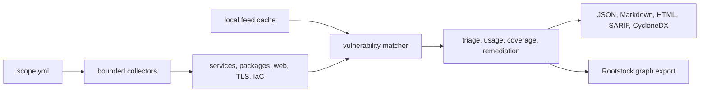

# cve-scan

`cve-scan` is the Rootstock CVE evidence module: a dependency-light Python CLI
for local CVE triage across a declared infrastructure scope. It is built for
quick operator checks from a Mac or workstation: collect bounded evidence, match
it against local vulnerability feeds, explain coverage gaps, and write
machine-readable reports for follow-up.

It is intentionally not a full vulnerability-management platform. It does not
try to replace Nessus, OpenVAS, Trivy, Grype, OSV-Scanner, Nuclei, Snyk, or
Burp. Its useful niche is smaller: explicit scope, local cacheable feeds,
conservative evidence, and output that can be reviewed or handed to graph tools
such as Rootstock.

## Quick Start

From a source checkout, either install the package in editable mode:

```bash
python -m pip install -e '.[dev]'
cve-scan init
cve-scan update-feeds --cache /tmp/cve-scan-cache
cve-scan checks
cve-scan scan --scope examples/local-scope.yml --out /tmp/cve-scan-smoke --cache /tmp/cve-scan-cache
cve-scan report /tmp/cve-scan-smoke
cve-scan export-rootstock /tmp/cve-scan-smoke
```

Or run directly with the `src` package path:

```bash
PYTHONPATH=src python -m cve_scan init
PYTHONPATH=src python -m cve_scan update-feeds --cache /tmp/cve-scan-cache
PYTHONPATH=src python -m cve_scan checks
PYTHONPATH=src python -m cve_scan scan --scope examples/local-scope.yml --out /tmp/cve-scan-smoke --cache /tmp/cve-scan-cache
PYTHONPATH=src python -m cve_scan report /tmp/cve-scan-smoke
PYTHONPATH=src python -m cve_scan export-rootstock /tmp/cve-scan-smoke
```

The smoke scope probes localhost, inspects the parent repository path, keeps
local Mac and Docker inventory disabled, and writes all output under `/tmp`.
Use a project-specific scope file before scanning anything beyond a local test.

## What It Does

- Scans only declared targets, URLs, credentials, repository paths, and optional
  local collectors from one scope file.
- Collects local service, TLS, web, repository manifest, host inventory, Mac
  inventory, Compose image, Docker image, dependency-path, and IaC/config
  evidence where enabled.
- Updates vulnerability intelligence separately from scanning through
  `update-feeds`; scan runs are deterministic from the local cache unless
  online fallback is explicitly enabled.
- Registers local mirrors for GitHub Advisory Database, GitLab Advisory
  Database, and CVE List V5 without copying those source trees into the cache.
- Emits JSON, Markdown, HTML, SARIF, CycloneDX SBOM/VDR, diff reports,
  remediation queues, and a Rootstock-style graph export.
- Adds local triage score, asset context, remediation, coverage, usage, and
  evidence-quality metadata to findings without claiming exploitability beyond
  the evidence collected.



## Outputs

Each scan directory can contain:

- `scan.json`: full scan record, findings, warnings, timings, cache metadata,
  coverage, queues, and enriched evidence.
- `findings.json`, `warnings.json`, `summary.md`, `summary.html`,
  `triage.md`, and `remediation.csv`.
- `findings.sarif` for code scanning integrations.
- `sbom.cdx.json` and `vdr.cdx.json` for CycloneDX consumers.
- `rootstock-export.json` with conservative graph nodes and edges.
- `diff.json`, `diff.md`, and `diff.html` when `report --baseline` is used.

Import `rootstock-export.json` into Rootstock with:

```bash
python3 ../../graph/import_cve_scan.py --input /tmp/cve-scan-smoke/rootstock-export.json
```

From the Rootstock repository root, the same artifact can be included in a full
collector pipeline run with:

```bash
NEO4J_PASSWORD=CHANGE_ME bash graph/pipeline.sh examples/demo-scan.json \
  --cve-scan-export /tmp/cve-scan-smoke/rootstock-export.json
```

A compact synthetic outcome for GitHub readers is available in
[example outcome](docs/example-outcome.md). It shows the report shape without
publishing a real network or project assessment.

## Scope Files

Every scan starts from a strict scope file. Targets and repository paths must be
declared before they are touched. Aggressive web probes are disabled unless the
scope or CLI enables them, and each web entry keeps its own allowed domains,
allowed paths, request budget, and rule actions.

```yaml
name: local-smoke
scan_profile: standard
aggressive_web: false
request_budget: 20
rate_limit_per_second: 10
max_cidr_hosts: 16
max_manifest_depth: -1
exclude_hosts: []
exclude_paths: []
local_inventory:
  homebrew: false
  python_global: false
  npm_global: false
container_inventory:
  local_docker: false
targets:
  - host: 127.0.0.1
    ports: [1, 80, 443]
web:
  - url: http://127.0.0.1/
    allowed_domains: [127.0.0.1]
    allowed_paths: [/]
    profile: passive-baseline
    collect_javascript_inventory: true
    web_rules:
      web.missing-security-header: warn
      web.exposed-server-header: info
repo_paths:
  - ..
```

Scan profiles are `quick` and `standard`. `quick` keeps authorization unchanged
but reduces work, keeps web probing passive, and loads only matching feed index
shards where possible.

More detail: [usage](docs/usage.md) and [architecture](docs/architecture.md).

## How It Compares

`cve-scan` is a focused triage tool, not a universal scanner.

| Tool family | Strong fit | How `cve-scan` differs |
| --- | --- | --- |
| Trivy, Grype, Syft, OSV-Scanner | Container, SBOM, filesystem, and language package vulnerability scanning | `cve-scan` has narrower package/container coverage, but combines package evidence with scoped service, web, TLS, IaC, coverage, remediation, and Rootstock handoff. |
| cve-bin-tool, OWASP Dependency-Check | Component and dependency vulnerability analysis | `cve-scan` keeps dependency parsing smaller and focuses on operator-owned scope evidence rather than broad ecosystem analyzers. |
| Nessus, OpenVAS | Full network vulnerability assessment and policy-driven scanning | `cve-scan` has no plugin feed, scheduler, appliance UI, or compliance benchmark suite; it stays local, explicit, and bounded. |
| Nuclei | Template-driven active checks for modern exploit and misconfiguration detection | `cve-scan` does not run community exploit templates; its web checks are intentionally small and scoped. |
| Snyk | Cloud-backed developer security, PR checks, fix workflows, and governance | `cve-scan` does not require a SaaS account and does not auto-fix; it writes local artifacts for human review. |

See [comparison](docs/comparison.md) for a concise feature-by-feature view and
source links.

## Commands

```bash
python -m cve_scan --help
python -m cve_scan init
python -m cve_scan update-feeds
python -m cve_scan update-feeds --dry-run
python -m cve_scan update-feeds --online
python -m cve_scan update-feeds --github-advisory-dir /path/to/advisory-database
python -m cve_scan update-feeds --gitlab-advisory-dir /path/to/advisories-community
python -m cve_scan update-feeds --cve-list-v5-dir /path/to/cvelistV5
python -m cve_scan checks
python -m cve_scan scan --scope examples/local-scope.yml --out runs/local
python -m cve_scan scan --profile quick --scope examples/local-scope.yml --out runs/quick
python -m cve_scan report runs/local
python -m cve_scan report runs/local --baseline runs/previous
python -m cve_scan export-rootstock runs/local
```

## Development

Runtime dependencies are intentionally empty. Development uses `pytest`, `ruff`,
and `shellcheck`.

```bash
python -m pip install -e '.[dev]'
ruff check .
pytest
shellcheck scripts/perf-smoke.sh
python -m cve_scan --help
python -m cve_scan checks
python -m cve_scan update-feeds --cache /tmp/cve-scan-cache
python -m cve_scan update-feeds --cache /tmp/cve-scan-cache --dry-run
python -m cve_scan scan --scope examples/local-scope.yml --out /tmp/cve-scan-smoke --cache /tmp/cve-scan-cache
python -m cve_scan report /tmp/cve-scan-smoke
python -m cve_scan export-rootstock /tmp/cve-scan-smoke
find src cve_scan tests scripts -type f \( -name '*.py' -o -name '*.sh' \) -not -path '*/__pycache__/*' -print0 | xargs -0 wc -l | awk '$2 != "total" && $1 > 550 {print}'
```

The LOC command should print nothing; `tests/test_line_budget.py` enforces the
same per-file budget as a maintainability policy check. It is not runtime
correctness evidence; behavior must be covered by focused domain tests.

## License

MIT. See [LICENSE](LICENSE).
