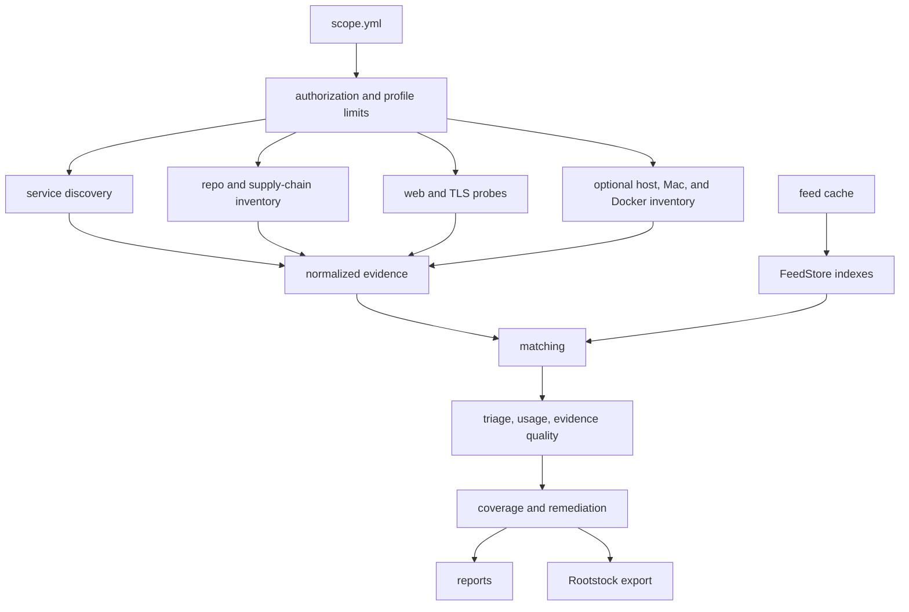
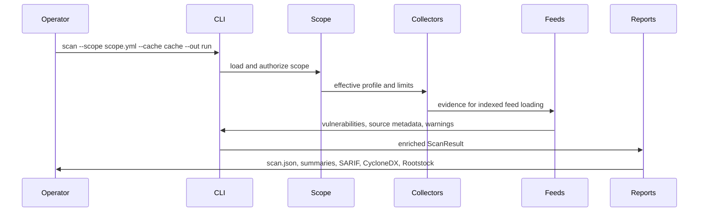

# Architecture

`cve-scan` keeps the scanner small by treating each stage as a narrow data
contract: scope parsing, evidence collection, feed loading, matching,
enrichment, and reporting.

## Core Boundaries

- `scope` validates authorization before any collector runs.
- Collectors emit normalized services, packages, web observations, certificates,
  warnings, and config findings.
- `FeedStore` loads local vulnerability data and indexes package names, PURLs,
  CPEs, and products.
- Matching creates findings with explicit evidence and feed provenance.
- Report enrichment adds triage score, usage signal, evidence quality, coverage
  records, remediation bundles, and owner/SLA queues.
- Report writers serialize the same result into JSON, Markdown, HTML, SARIF,
  CycloneDX, and Rootstock graph formats.

## Data Flow

## Design Choices

- Scans are local-first. Network access for feed refresh is explicit and
  separate from normal scan execution.
- Active web behavior is bounded by declared domains, paths, request budgets,
  and profile settings.
- The scanner records uncertainty. Coverage gaps, unsupported shapes, missing
  advisory coverage, malformed cache entries, and failed optional collectors
  become warnings or coverage entries.
- Rootstock receives evidence-backed graph nodes and edges. Deeper attack-path
  reasoning stays outside `cve-scan`.
- The project intentionally avoids broad dependencies while the current narrow
  parsers are sufficient for the supported formats.
